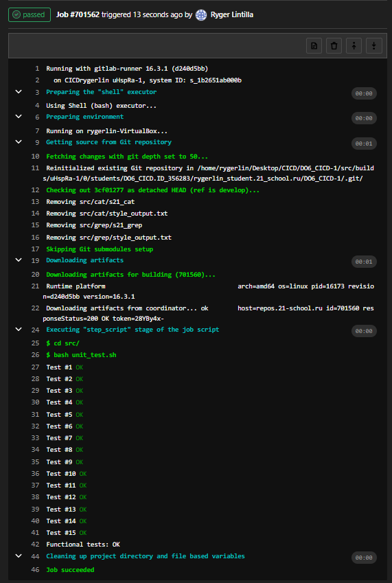
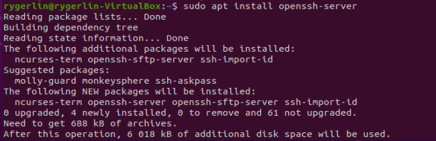

# Basic CI/CD

### Part 1. Настройка **gitlab-runner**

##### Поднять виртуальную машину *Ubuntu Server 20.04 LTS*
*Будьте готовы, что в конце проекта нужно будет сохранить дамп образа виртуальной машины*

##### Скачать и установить на виртуальную машину **gitlab-runner**
- sudo apt install gitlab-runner

##### Запустить **gitlab-runner** и зарегистрировать его для использования в текущем проекте (*DO6_CICD*)
- Для регистрации понадобятся URL и токен, которые можно получить на страничке задания на платформе.
- gitlab-runner register

### Part 2. Сборка

#### Написать этап для **CI** по сборке приложений из проекта *C2_SimpleBashUtils*:

##### В файле _gitlab-ci.yml_ добавить этап запуска сборки через мейк файл из проекта _C2_

##### Файлы, полученные после сборки (артефакты), сохранять в произвольную директорию со сроком хранения 30 дней.
- добавим инструкцию в .yml

- проверка работы

### Part 3. Тест кодстайла

`-` Поздравляю, вы выполнили абсолютно бессмысленную задачу. Шучу. Она была нужна для перехода ко всем последующим.

**== Задание ==**

#### Написать этап для **CI**, который запускает скрипт кодстайла (*clang-format*):
- добавим инструкцию в .yml

##### Если кодстайл не прошел, то "зафейлить" пайплайн
##### В пайплайне отобразить вывод утилиты *clang-format*
- скрипт для проверки

- тесты на стиль пройдены

- тесты на стиль провалены

### Part 4. Интеграционные тесты

#### Написать этап для **CI**, который запускает ваши интеграционные тесты из того же проекта:
- добавим инструкцию в .yml

- скрипт для интеграционных тестов

##### Запускать этот этап автоматически только при условии, если сборка и тест кодстайла прошли успешно

##### Если тесты не прошли, то "зафейлить" пайплайн

##### В пайплайне отобразить вывод, что интеграционные тесты успешно прошли / провалились
- интеграционные тесты пройдены

- интеграционные тесты провалены

- прерывание процесса при фейле предыдущего этапа

### Part 5. Этап деплоя

##### Поднять вторую виртуальную машину *Ubuntu Server 20.04 LTS*
- yaml-файлы

- машины пингуются

- настройка второй виртуальной машины

- подключение ко второй машине через ssh без необходимости ввода пароля

#### Написать этап для **CD**, который "разворачивает" проект на другой виртуальной машине:
##### Запускать этот этап вручную при условии, что все предыдущие этапы прошли успешно
- добавим инструкцию в .yml

##### Написать bash-скрипт, который при помощи **ssh** и **scp** копирует файлы, полученные после сборки (артефакты), в директорию */usr/local/bin* второй виртуальной машины
*Тут вам могут помочь знания, полученные в проекте DO2_LinuxNetwork*
- bash скрипт deploy

##### В файле _gitlab-ci.yml_ добавить этап запуска написанного скрипта

##### В случае ошибки "зафейлить" пайплайн

В результате вы должны получить готовые к работе приложения из проекта *C2_SimpleBashUtils* (s21_cat и s21_grep) на второй виртуальной машине.
- deploy на gitlab

### Part 6. Дополнительно. Уведомления

##### Настроить уведомления о успешном/неуспешном выполнении пайплайна через бота с именем "[ваш nickname] DO6 CI/CD" в *Telegram*
- пишем @BotFather в телеграм, создаём бота, получаем токен.

- скрипт для работы бота

- добавляем вызов скрипта после каждого этапа в .gitlab-ci.yml

- Текст уведомления должен содержать информацию об успешности прохождения как этапа **CI**, так и этапа **CD**.
- В остальном текст уведомления может быть произвольным.
- результат

