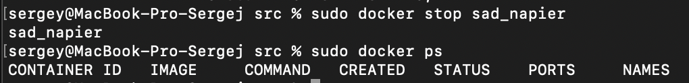
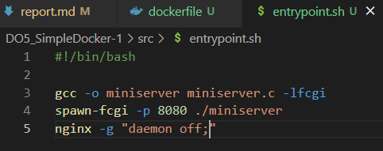
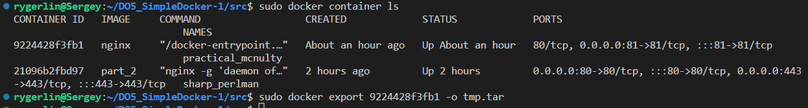

## Part 1. Готовый докер  
#### 1) Взять официальный докер образ с nginx и выкачать его при помощи docker pull  
* используем команду `sudo docker pull nginx`  
  

#### 2) Проверить наличие докер образа через docker images  
* используем команду `sudo docker images`  
  

#### 3-4) Запустить докер образ через `docker run -d [image_id|repository]` и проверить что образ запустился через `docker ps`  
* используем команду `sudo docker run -d nginx` и проверяем, что образ запустился с помощью команды `sudo docker ps`  
 

#### 5) Посмотреть информацию о контейнере через `docker inspect [container_id|container_name]`  
* используем команду `sudo docker inspect sad_napier`  
 

#### 6) По выводу команды определить и поместить в отчёт размер контейнера, список замапленных портов и ip контейнера  
* найдём размер контейнера командой `sudo docker inspect sad_napier --size | grep -i SizeRw`  
  

* найдём в выводе команды `sudo docker inspect sad_napier` список портов  
 

* найдём ip контейнера командой `sudo docker inspect sad_napier | grep -i ip`  
  

#### 7-8) Остановить докер образ через `docker stop [container_id|container_name]` и проверить, что образ остановился через `docker ps`  
* используем команду `sudo docker stop sad_napier` и проверяем остановку командой `sudo docker ps`  
 

#### 9) Запустить докер с замапленными портами 80 и 443 на локальную машину через команду `run`  
* используем команду `sudo docker run -d -p 80:80 -p 443:443 nginx` и сразу проверим запуск и порты командой `sudo docker ps`  
 

#### 10) Проверить, что в браузере по адресу localhost:80 доступна стартовая страница nginx  
* Открываем любой браузер и в адресной строке пишем localhost:80  
 

## Part 2. Операции с контейнером  
#### 1) Прочитать конфигурационный файл nginx.conf внутри докер контейнера через команду `exec`  
* используем команду `sudo docker exec determined_cohen cat /etc/nginx/nginx.conf`  
  

#### 2) Создать на локальной машине файл nginx.conf  
* создаём файл  
 

#### 3) Настроить в нем по пути /status отдачу страницы статуса сервера nginx  
* дописываем блок http  
   

#### 4-5) Скопировать созданный файл nginx.conf внутрь докер образа через команду `docker cp` и Перезапустить nginx внутри докер образа через команду `exec`  
* копируем файл командой `sudo docker cp nginx.conf determined_cohen:etc/nginx/` и перезапускаем nginx командой `sudo docker exec determined_cohen nginx -s reload`  
  

#### 6) Проверить, что по адресу localhost:80/status отдается страничка со статусом сервера nginx  
* открываем браузер и проверяем  
 

#### 7) Экспортировать контейнер в файл container.tar через команду export  
* экспортируем контейнер командой `sudo docker export -o container.tar compassionate_hofstadter  `
  

#### 8) Остановить контейнер  
* останавливаем контейнер командой `sudo docker stop compassionate_hofstadter`  
  

#### 9-10) Удалить образ через `docker rmi [image_id|repository]`, не удаляя перед этим контейнеры  
* удаляем образ командой `sudo docker rmi -f nginx`  
* удаляем контейнер командой `sudo docker rm compassionate_hofstadter` 
  

#### 11) Импортировать контейнер обратно через команду import  
* используем команду `sudo docker import -c 'CMD ["nginx", "-g", "daemon off;"]' container.tar part_2`  
   

#### 12) Запустить импортированный контейнер  
* запускаем контейнер командой `sudo docker run -d -p 80:80 -p 443:443 part_2`  
   

#### 13) Проверить, что по адресу localhost:80/status отдается страничка со статусом сервера nginx  
* открываем браузер и смотрим  
 
## Part 3. Мини веб-сервер  
* Пишем мини сервер на C и FastCgi, который будет возвращать простейшую страничку с надписью `Hello World!`  

* Пишем свой nginx.conf, который будет проксировать все запросы с 81 порта на 127.0.0.1:8080  
 

* Качаем образ nginx, запускаем контейнер, копируем c файл сервера и conf файл nginx  
  

* Заходим в контейнер командой `docker exec -it ecstatic_kare bash`, обновляем репозитории, устанавливаем gcc, spawn-fcgi и libfcgi-dev  

 

* Компилируем и запускаем сервер  
 

* проверяем нашу страничку  
 

## Part 4. Свой докер  
* Создаём докерфайл  

* Создаём скрипт, выполняющий роль entrypoint  
 

* Собираем образ через `docker build` при этом указав имя и тег  

* проверяем через `docker images`, что все собралось корректно  

* прежде чем запускать вытащим из образа папку nginx для последующего маппинга  

  

* Запускаем собранный докер образ с маппингом 81 порта на 80 на локальной машине и маппингом папки ./nginx внутрь контейнера по адресу, где лежат конфигурационные файлы nginx'а  
 

* проверяем в браузере  
  

* Дописываем в ./nginx/nginx.conf проксирование странички /status, по которой надо отдавать статус сервера nginx  
 

* Перезапускаем докер образ и проверяем 
   
   

## Part 5. Dockle  
* сперва установим доклю  

* потом проверим образ  
 

* C ошибкой CIS-DI-0010 можно было разобраться только сменой образа на Alpine  
* переписываем докерфайл  
 

* Ошибки устранены  

## Part 6. Базовый Docker Compose  
* Перепишем скрипт entrypoint для второго контейнера, иначе он будет завершать работу после `docker-compose up`  

* Перепишем _**nginx.conf**_ для проксирования  
 

* напишем **_docker-compose.yml_**  
 

* билдим командой `sudo docker-compose build`  
 

* запускаем командой `sudo docker-compose up`  
 

* проверяем в браузере  
  
  