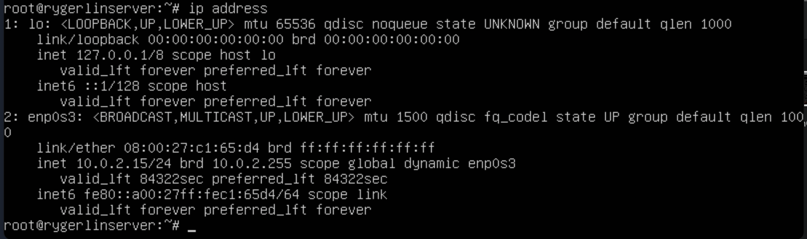
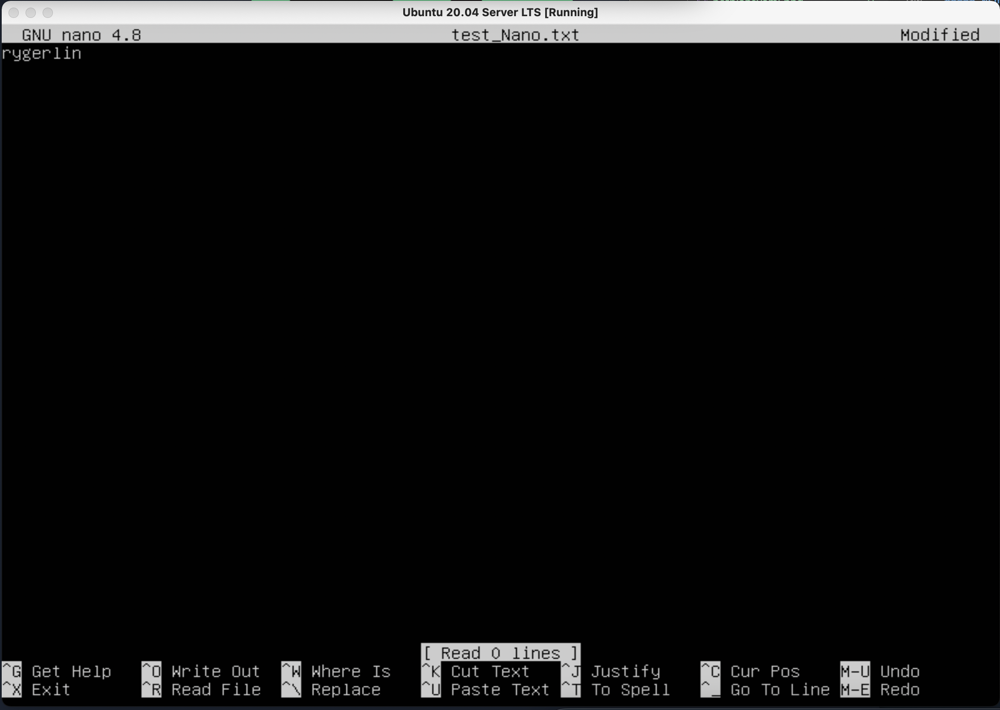

# Операционные системы UNIX/Linux (Базовый).

## Part 1. Установка ОС

##### Установить **Ubuntu 20.04 Server LTS** без графического интерфейса. (Используем программу для виртуализации - VirtualBox)

- Узнайте версию Ubuntu, выполнив команду \
`cat /etc/issue.`

## Part 2. Создание пользователя

##### Создать пользователя, отличного от пользователя, который создавался при установке. Пользователь должен быть добавлен в группу `adm`.

- Вставьте скриншот вызова команды для создания пользователя.

- Новый пользователь должен быть в выводе команды \
`cat /etc/passwd`
- Вставьте скриншот с выводом команды.

## Part 3. Настройка сети ОС

##### Задать название машины вида user-1  

##### Установить временную зону, соответствующую вашему текущему местоположению.

##### Вывести названия сетевых интерфейсов с помощью консольной команды.

- В отчёте дать объяснение наличию интерфейса lo.

##### Используя консольную команду получить ip адрес устройства, на котором вы работаете, от DHCP сервера. 

- В отчёте дать расшифровку DHCP.  

##### Определить и вывести на экран внешний ip-адрес шлюза (ip) и внутренний IP-адрес шлюза, он же ip-адрес по умолчанию (gw). 

##### Задать статичные (заданные вручную, а не полученные от DHCP сервера) настройки ip, gw, dns (использовать публичный DNS серверы, например 1.1.1.1 или 8.8.8.8).  

##### Перезагрузить виртуальную машину. Убедиться, что статичные сетевые настройки (ip, gw, dns) соответствуют заданным в предыдущем пункте.

## Part 4. Обновление ОС

##### Обновить системные пакеты до последней на момент выполнения задания версии.  

## Part 5. Использование команды **sudo**

##### Разрешить пользователю, созданному в [Part 2](#part-2-создание-пользователя), выполнять команду sudo.

 ##### Команда sudo (SuperUser DO - «подменить пользователя и выполнить») позволяет запускать программы от имени администратора или root-пользователя. Можно добавить sudo перед любой командой, чтобы запустить её от имени администратора.

## Part 6. Установка и настройка службы времени

##### Настроить службу автоматической синхронизации времени.  

`sudo ntpdate pool.ntp.org`

## Part 7. Установка и использование текстовых редакторов 

##### Установить текстовые редакторы **VIM** (+ любые два по желанию **NANO**, **MCEDIT**, **JOE** и т.д.)  

##### Используя каждый из трех выбранных редакторов, создайте файл *test_X.txt*, где X -- название редактора, в котором создан файл. Напишите в нём свой никнейм, закройте файл с сохранением изменений.  

vim

exit with save: esc - :wq

nano

exit with save:  ^X -> Yes -> enter  

exit with save:  ^K X

##### Используя каждый из трех выбранных редакторов, откройте файл на редактирование, отредактируйте файл, заменив никнейм на строку "21 School 21", закройте файл без сохранения изменений.

vim

exit without save: esc - :q!

nano

exit without save:  ^X -> No

joe

exit without save:  ^C -> y

##### Используя каждый из трех выбранных редакторов, отредактируйте файл ещё раз (по аналогии с предыдущим пунктом), а затем освойте функции поиска по содержимому файла (слово) и замены слова на любое другое.
vim

search - :s/{pattern}

change - :s/{pattern}/{string}

nano

search - ^W

change - ^\ -> {pattern} -> {string}

joe

search - ^K F {pattern} (ищет по строке, следующей за курсором)

change - ^K F {pattern} -> R -> {string} -> Y

## Part 8. Установка и базовая настройка сервиса **SSHD**

##### Установить службу SSHd.  

`sudo apt install openssh-server`

##### Добавить автостарт службы при загрузке системы.  

` sudo systemctl enable ssh`

##### Перенастроить службу SSHd на порт 2022.  
1. резервная копия   
` sudo cp /etc/ssh/sshd_config /etc/ssh/sshd_config.factory-defaults` 
2. настройка конфигурационного файла   
`sudo vi /etc/ssh/sshd_config`   

3. ` sudo systemctl restart ssh`
4. ` sudo systemctl status ssh`

##### Используя команду ps, показать наличие процесса sshd. 

##### Команда ps является инструментом для определения работающих в системе программ и оценки используемых ими ресурсов. Она выводит статистику и информацию о состоянии процессов в системе, в том числе ИД процесса или нити, объем выполняемого ввода-вывода и используемый объем ресурсов процессора и памяти.
  - -A, -e, (a) - выбрать все процессы;
  - -a - выбрать все процессы, кроме фоновых;
  - -d, (g) - выбрать все процессы, даже фоновые, кроме процессов сессий;
  - -N - выбрать все процессы кроме указанных;
  - -С - выбирать процессы по имени команды;
  - -G - выбрать процессы по ID группы;
  - -p, (p) - выбрать процессы PID;
  - --ppid - выбрать процессы по PID родительского процесса;
  - -s - выбрать процессы по ID сессии;
  - -t, (t) - выбрать процессы по tty;
  - -u, (U) - выбрать процессы пользователя.

  ##### Опции форматирования:
  - -с - отображать информацию планировщика;
  - -f - вывести максимум доступных данных, например, количество потоков;
  - -F - аналогично -f, только выводит ещё больше данных;
  - -l - длинный формат вывода;
  - -j, (j) - вывести процессы в стиле Jobs, минимум информации;
  - -M, (Z) - добавить информацию о безопасности;
  - -o, (o) - позволяет определить свой формат вывода;
  - --sort, (k) - выполнять сортировку по указанной колонке;
  - -L, (H)- отображать потоки процессов в колонках LWP и NLWP;
  - -m, (m) - вывести потоки после процесса;
  - -V, (V) - вывести информацию о версии;
  - -H - отображать дерево процессов;

##### Перезагрузить систему.

Параметр -ta отображает только информацию о TCP-соединениях.
При пропуске параметра -n вместо IP-адресов печатаются имена хостов

## Part 9. Установка и использование утилит **top**, **htop**

##### Установить и запустить утилиты top и htop.  

- По выводу команды top:
  - uptime -> 4:00
  - количество авторизованных пользователей -> 1 user
  - общую загрузку системы -> 0.00, 0.00, 0.00
  - общее количество процессов -> 101
  - загрузку cpu, % -> 0.0us,  0.0sy,  0.0ni, 100.0id,  0.0wa,  0.0hi,  0.0si,  0.0st
  - загрузку памяти -> 1983,4 total,  943,8 free,  168.5 used,   871.1 buff/cache
  - pid процесса занимающего больше всего памяти -> 1
  - pid процесса, занимающего бvольше всего процессорного времени -> 1

- В отчёт вставить скрин с выводом команды htop:
  - отсортированному по PID, PERCENT_CPU, PERCENT_MEM, TIME
  
  
  
  
  - отфильтрованному для процесса sshd
    
  - с процессом syslog, найденным, используя поиск 
   
  - с добавленным выводом hostname, clock и uptime  
    

## Part 10. Использование утилиты **fdisk**

##### Запустить команду fdisk -l.
 

- Disk: VBOX HARDDISK  
- size: 10Gib 
- sectors count: 20971520

## Part 11. Использование утилиты **df** 

##### Запустить команду df.  
- В отчёте написать для корневого раздела (/):
  - размер раздела: 8408452
  - размер занятого пространства: 4029692
  - размер свободного пространства: 3930044
  - процент использования: 51%
  - единица измерения: КБ

##### Запустить команду df -Th.
- В отчёте написать для корневого раздела (/):
    - размер раздела 8.1Gb
    - размер занятого пространства 3.9Gb
    - размер свободного пространства 3.8Gb
    - процент использования 51%
    - тип файловой системы: ext4

## Part 12. Использование утилиты **du**

##### Запустить команду du.
##### Вывести размер папок /home, /var, /var/log (в байтах, в человекочитаемом виде)

- Вывести размер папки /home

- Вывести размер папки /var

- Вывести размер папки /var/log

##### Вывести размер всего содержимого в /var/log (не общее, а каждого вложенного элемента, используя *)

- В отчёт вставить скрины с выводом всех использованных команд.

## Part 13. Установка и использование утилиты **ncdu**

##### Установить утилиту ncdu.
##### Вывести размер папок /home, /var, /var/log.

- Вывести размер папки /home

- Вывести размер папки /var

- Вывести размер папки /var/log

## Part 14. Работа с системными журналами

##### Открыть для просмотра:
##### 1. /var/log/dmesg

##### 2. /var/log/syslog

##### 3. /var/log/auth.log  

- Написать в отчёте время последней успешной авторизации, имя пользователя и метод входа в систему.
- Перезапустить службу SSHd.
`reboot`
- Вставить в отчёт скрин с сообщением о рестарте службы (искать в логах).

## Part 15. Использование планировщика заданий **CRON**

##### Используя планировщик заданий, запустите команду uptime через каждые 2 минуты.
- Найти в системных журналах строчки (минимум две в заданном временном диапазоне) о выполнении.

- Вывести на экран список текущих заданий для CRON.

##### Удалите все задания из планировщика заданий.

